# 🧠 Adult Income Classification using Deep Learning

## 📌 Project Overview

This project performs **Binary Classification** using **Deep Learning** techniques on the **Adult Income / Census Income dataset**.

The objective is to predict whether an individual's annual income is:

- **0 – <=50K**
- **1 – >50K**

The project implements and compares multiple Artificial Neural Network configurations covering **MLP architecture, activation functions, weight initialization, loss functions, Batch Normalization, and optimizers**.

The complete practical follows all seven tasks specified in **Deep Learning Practical Report 2 (PR 2)**.

---

## 📺 Presentation Video

👉 **https://drive.google.com/file/d/16ybJtslHuO4M240rghvHcEmVf1IjCBSL/view?usp=sharing**


# 🎯 Objectives

- Analyze the Adult Income / Census Income dataset.
- Perform data cleaning and exploratory data analysis.
- Handle missing values represented by `?`.
- Remove redundant and non-predictive columns.
- Encode the binary income target.
- Apply One-Hot Encoding to categorical variables.
- Apply StandardScaler only to numeric features.
- Use a stratified train-test split.
- Build a reusable MLP/ANN architecture.
- Train a baseline ANN using ReLU, Glorot Uniform, Adam and Binary Crossentropy.
- Compare ReLU, Tanh, Sigmoid and ELU activation functions.
- Analyze ReLU dead neurons.
- Demonstrate vanishing gradients with sigmoid hidden layers.
- Compare Glorot and He weight initialization techniques.
- Demonstrate the failure of zero initialization.
- Compare Binary Crossentropy and MSE.
- Implement Weighted Binary Crossentropy.
- Implement Focal Loss.
- Apply Batch Normalization.
- Compare BatchNorm placement.
- Inspect learned BatchNorm gamma and beta.
- Compare SGD, SGD + Momentum, RMSprop and Adam.
- Perform learning-rate sensitivity analysis.
- Build a final combined ANN model.
- Compare models using Accuracy, Precision, Recall, F1-score and ROC-AUC.

---

# 📂 Dataset

- **Dataset:** Adult Income Dataset / Census Income
- **Learning Type:** Supervised Learning — Binary Classification
- **Original Records:** 48,842
- **Original Columns:** 15
- **Target Column:** `income`
- **Source:** UCI Adult / Census Income dataset

### Target Classes

- **0 – <=50K**
- **1 – >50K**

### Important Dataset Columns

The uploaded CSV uses:

- `age`
- `workclass`
- `fnlwgt`
- `education`
- `educational-num`
- `marital-status`
- `occupation`
- `relationship`
- `race`
- `gender`
- `capital-gain`
- `capital-loss`
- `hours-per-week`
- `native-country`
- `income`

### Missing Values

Missing values are represented using:

```text
?
```

The project replaces `?` with `NaN` and removes rows containing missing values.

### Actual Uploaded Dataset Result

```text
Original rows       : 48,842
Rows after dropna   : 45,222
Columns after drops : 13
Encoded features    : 80
```

The actual uploaded `adult.csv` is used as the source of truth.

---

# 🚀 Project Workflow

## 📖 Step 1 – Data Loading, Cleaning & Exploratory Data Analysis

Performed:

- Loaded `adult.csv`
- Checked dataset shape
- Checked column names and data types
- Displayed first five records
- Stripped whitespace from object columns
- Replaced `?` with `NaN`
- Checked missing values
- Dropped rows containing missing values
- Dropped `fnlwgt`
- Dropped text `education`
- Encoded `income`
- Checked class distribution
- Generated EDA visualizations
- One-hot encoded categorical features
- Applied numeric feature scaling
- Performed stratified train-test split

### 📊 Class Distribution

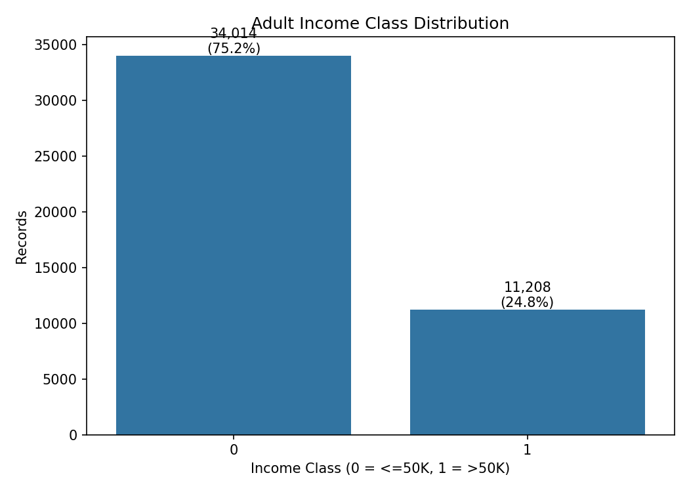

**Figure:** `eda_class_balance.png`

### 📊 Age Distribution by Income

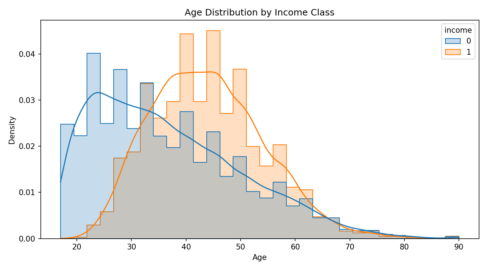

**Figure:** `eda_age_by_income.png`

### 📊 Hours per Week by Income

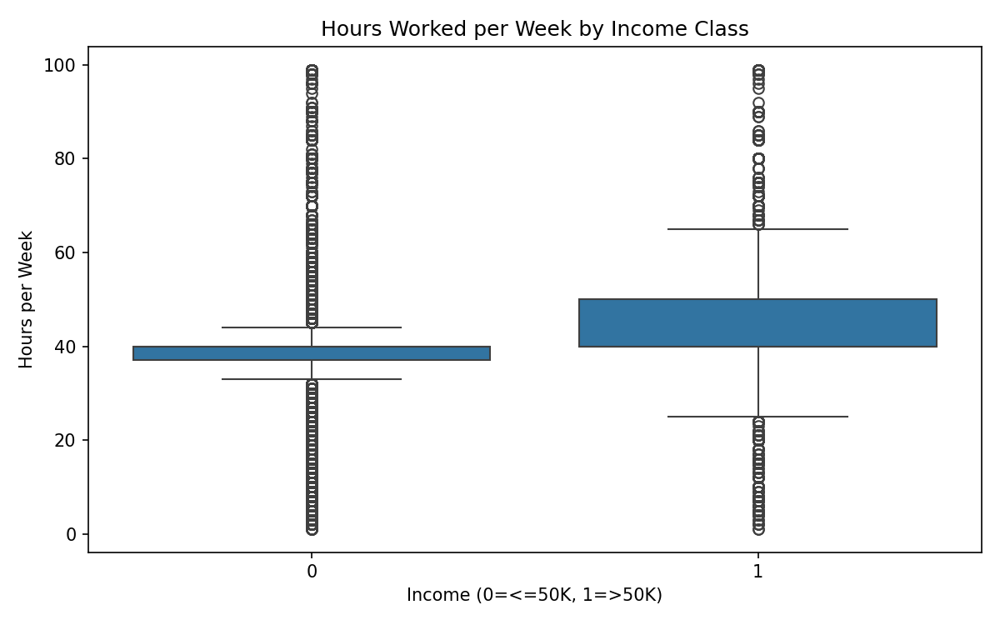

**Figure:** `eda_hours_boxplot.png`

### 📊 Education Level by Income

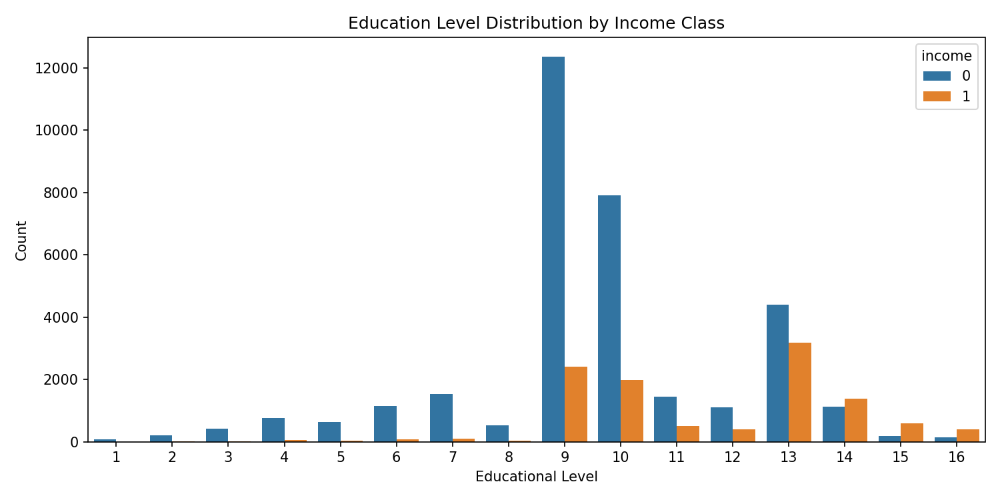

**Figure:** `eda_education_by_income.png`

### 📊 Numeric Correlation Heatmap

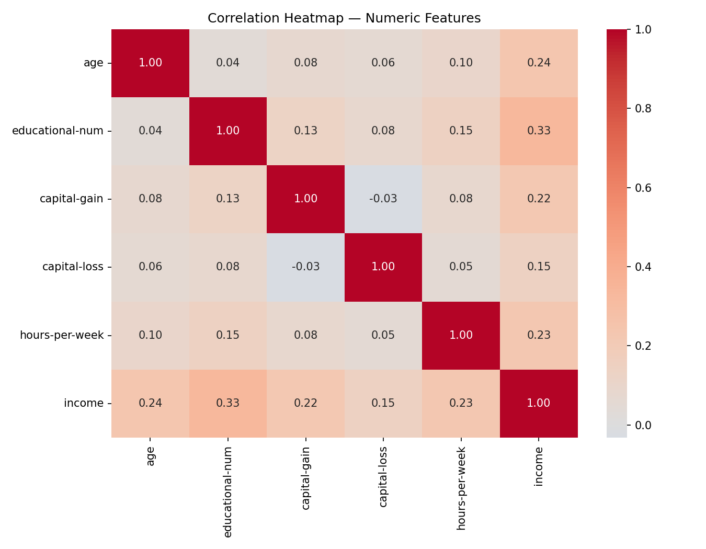

**Figure:** `eda_correlation_heatmap.png`

---

## ⚙️ Step 2 – Data Preprocessing

The following preprocessing pipeline was applied:

- Stratified train-test split
- `test_size=0.2`
- `random_state=42`
- `stratify=y`
- One-Hot Encoding using `pd.get_dummies()`
- `drop_first=True`
- StandardScaler for numeric columns

### Numeric Features Scaled

```text
age
educational-num
capital-gain
capital-loss
hours-per-week
```

The scaler is fitted only on `X_train` and then applied to both training and test data.

### Why StandardScaler?

Neural networks use gradient-based optimization. Features with very different numerical scales can make optimization slower or unstable.

StandardScaler transforms numeric features to approximately:

```text
Mean = 0
Standard Deviation = 1
```

Binary One-Hot Encoded columns remain as `0/1`.

---

## 🤖 Step 3 – Baseline MLP / ANN

A reusable `build_ann()` function was created so experiments can change one parameter at a time.

### Baseline Architecture

```text
Input Features
      ↓
Dense(128, ReLU)
      ↓
Dense(64, ReLU)
      ↓
Dense(1, Sigmoid)
      ↓
Binary Classification
```

### Baseline Configuration

```text
Activation    : ReLU
Initializer   : Glorot Uniform
Optimizer     : Adam
Loss          : Binary Crossentropy
Epochs        : 50
Batch Size    : 64
```

### Why Sigmoid Output?

The target has two classes. A single sigmoid output produces a probability between 0 and 1 and is therefore appropriate for binary classification.

### Parameter Verification

For the actual 80 encoded input features:

```text
First Dense:
80 × 128 + 128 = 10,368

Second Dense:
128 × 64 + 64 = 8,256

Output:
64 × 1 + 1 = 65

Total:
18,689 parameters
```

### 📈 Baseline Training Curves

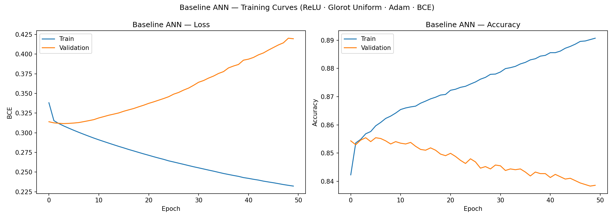

**Figure:** `baseline_training_curves.png`

### 📊 Baseline Confusion Matrix

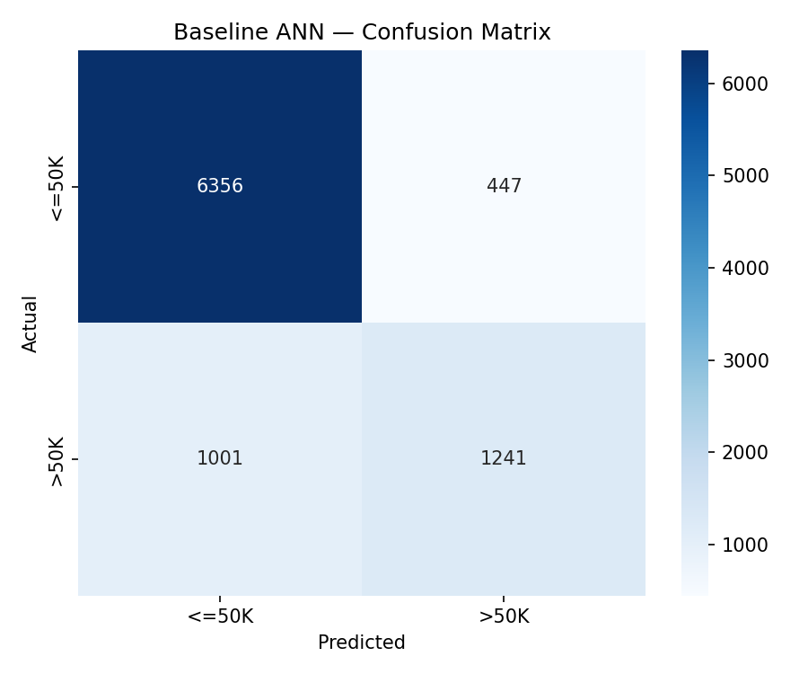

**Figure:** `baseline_confusion_matrix.png`

The baseline evaluation includes Accuracy, Precision, Recall, F1-score and ROC-AUC.

---

## 🧠 Step 4 – Activation Functions

Four hidden-layer activation functions were compared:

- ReLU
- Tanh
- Sigmoid
- ELU

### ReLU

```text
f(x) = max(0, x)
```

- Fast and efficient
- Commonly used in hidden layers
- Strong gradient flow for positive values
- Can suffer from dead neurons

### Tanh

```text
f(x) = tanh(x)
```

- Output range: `-1 to +1`
- Zero-centred
- Can suffer from vanishing gradients

### Sigmoid

```text
f(x) = 1 / (1 + e^-x)
```

- Output range: `0 to 1`
- Useful for binary output
- Can suffer from vanishing gradients in hidden layers

### ELU

```text
x                 if x > 0
α(e^x - 1)        if x <= 0
```

ELU allows negative outputs for negative inputs and can reduce dead-neuron behavior.

### 📊 Activation Function Comparison

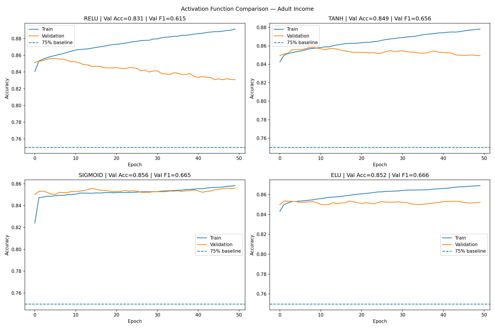

**Figure:** `activation_comparison.png`

### 🔎 ReLU Dead-Neuron Analysis

The first hidden-layer activations are inspected on 500 test samples.

```python
dead_fraction = np.mean(activations == 0)
```

**Figure:** `relu_activation_distribution.png`

### 📉 Sigmoid Gradient Flow Analysis

Gradient magnitudes are calculated for:

```text
Layer 1
Layer 2
Output Layer
```

**Figure:** `sigmoid_gradient_magnitude.png`

---

## ⚖️ Step 5 – Weight Initialization Techniques

The following initialization methods were compared:

- Glorot Uniform
- Glorot Normal
- He Uniform
- He Normal
- Zeros

### Glorot / Xavier

```text
Var(W) = 2 / (fan_in + fan_out)
```

### He Initialization

```text
Var(W) = 2 / fan_in
```

He initialization is particularly suitable for ReLU networks.

### Zero Initialization

All hidden neurons start identically, receive identical gradients and learn identical representations. This symmetry prevents the network from effectively using its hidden-layer width.

### 📈 Initialization Convergence Comparison

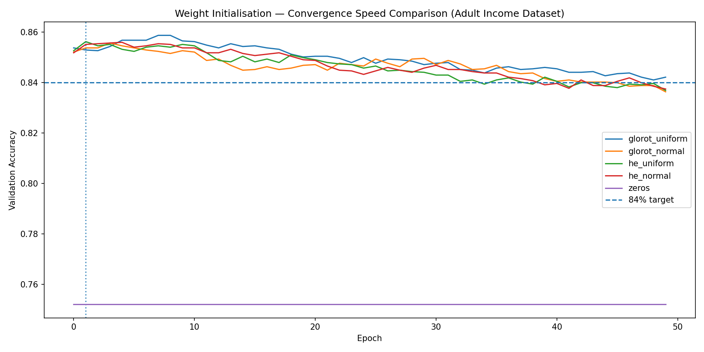

**Figure:** `initialiser_convergence.png`

### ❌ Zero Initialization Failure

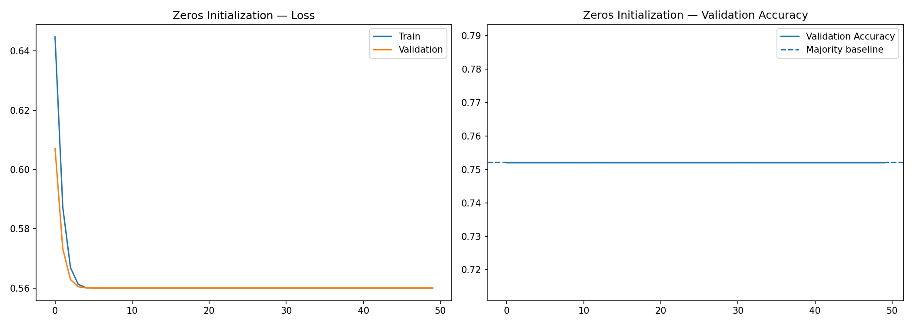

**Figure:** `zeros_failure.png`

### 📊 Weight Distributions

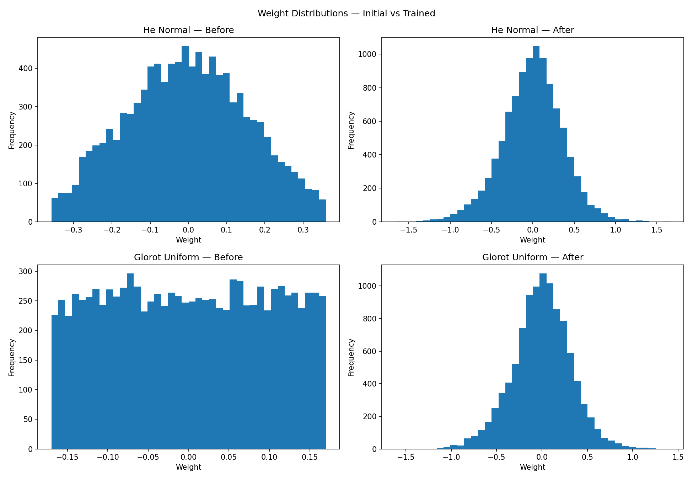

**Figure:** `weight_distributions.png`

---

## 📉 Step 6 – Loss Functions

The project compares:

- Binary Crossentropy
- Mean Squared Error
- Weighted Binary Crossentropy
- Focal Loss

### Binary Crossentropy

```text
L = -[y log(p) + (1-y) log(1-p)]
```

BCE is the natural loss for a sigmoid binary classifier.

### MSE as Classification Loss

MSE is included as a comparison experiment.

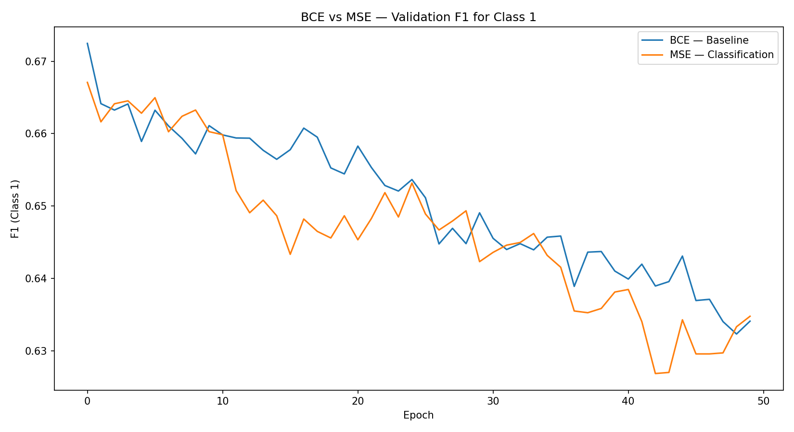

**Figure:** `loss_f1_comparison.png`

### Weighted Binary Crossentropy

Class weights are calculated using:

```python
compute_class_weight(
    class_weight="balanced",
    classes=[0, 1],
    y=y_train
)
```

Weighted BCE gives additional importance to minority-class samples.


**Figure:** `weighted_bce_metrics.png`

### Focal Loss

Focal Loss is implemented as a custom Keras loss.

Configuration:

```text
Gamma = 2.0
Alpha = 0.25
```

It reduces the contribution of easy examples and focuses more on difficult examples.

---

## 🧮 Step 7 – Batch Normalization

Batch Normalization is implemented using:

```text
Dense
  ↓
Batch Normalization
  ↓
ReLU
```

### BatchNorm Architecture

```text
Input
  ↓
Dense(128)
  ↓
BatchNorm
  ↓
ReLU
  ↓
Dense(64)
  ↓
BatchNorm
  ↓
ReLU
  ↓
Dense(1, Sigmoid)
```

### Why Batch Normalization?

Batch Normalization normalizes mini-batch activations and learns:

```text
Gamma (γ) → Scale
Beta  (β) → Shift
```

Formula:

```text
BN(x) = γ((x - μB) / √(σB² + ε)) + β
```

Benefits include faster convergence, more stable training and reduced sensitivity to learning rate.

### 📈 BatchNorm vs Baseline

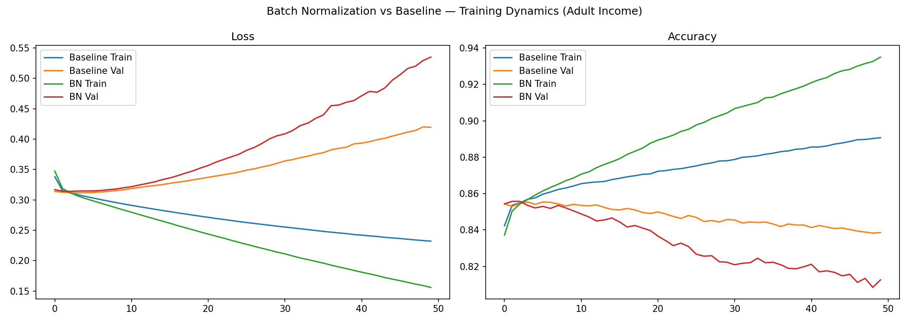

**Figure:** `batchnorm_dynamics.png`

### 🔄 BatchNorm Position Experiment

Compared:

```text
Dense → BatchNorm → ReLU
```

with:

```text
Dense → ReLU → BatchNorm
```

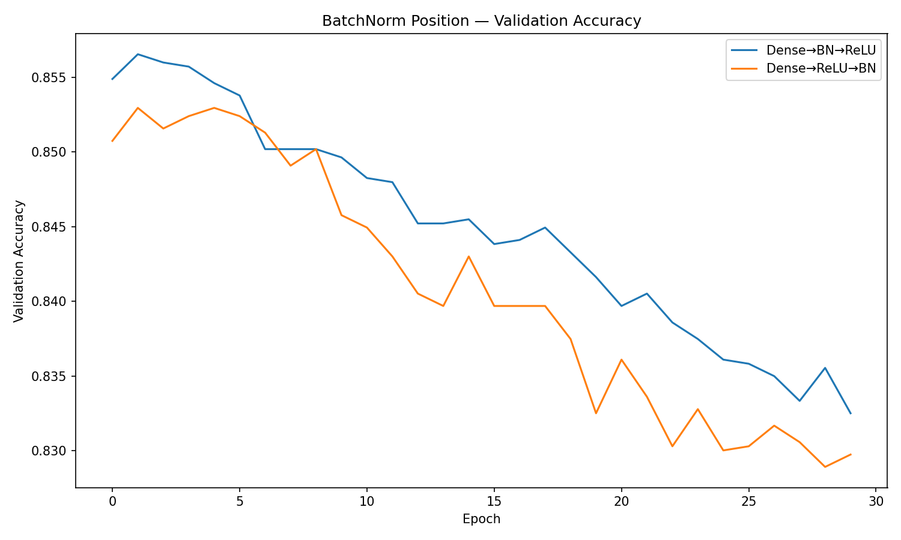

**Figure:** `batchnorm_position.png`

### 📊 Learned Gamma and Beta

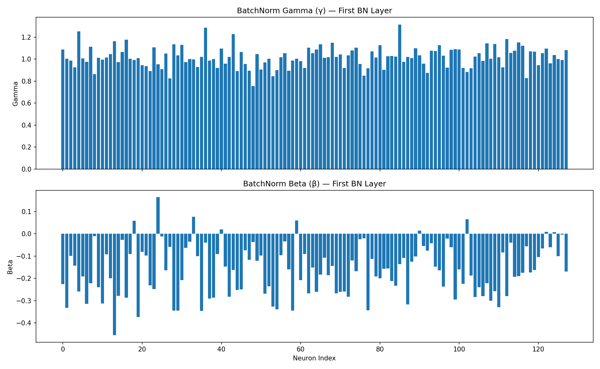

**Figure:** `batchnorm_gamma_beta.png`

---

## ⚡ Step 8 – Optimizers

The following optimizers were compared:

- SGD
- SGD + Momentum
- RMSprop
- Adam
- Explicit Adam

### SGD

Uses a fixed global learning rate.

### SGD + Momentum

Adds a velocity term to reduce oscillation and speed convergence.

### RMSprop

Uses a running average of squared gradients to adapt updates.

### Adam

Combines first-moment momentum, second-moment scaling and bias correction.

### Explicit Adam

```python
Adam(
    learning_rate=0.001,
    beta_1=0.9,
    beta_2=0.999
)
```

### 📈 Optimizer Comparison

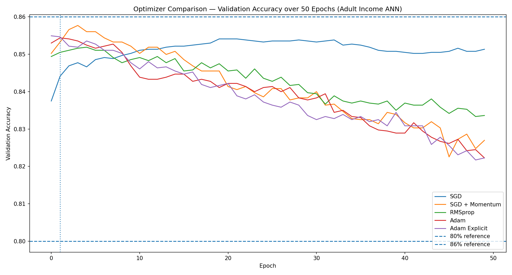

**Figure:** `optimiser_convergence.png`

---

## 🎚️ Step 9 – Learning Rate Sensitivity

### SGD Learning Rates

```text
0.0001
0.001
0.01
0.1
```

### Adam Learning Rates

```text
0.0001
0.001
0.01
```

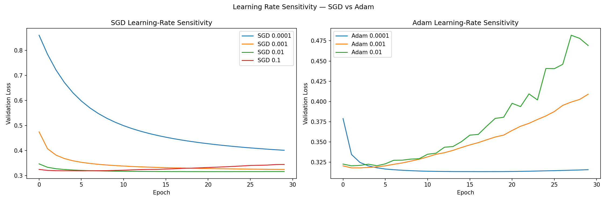

**Figure:** `learning_rate_sensitivity.png`

---

# 🏆 Final Combined ANN Model

The final model combines the strongest configuration discovered from the experiments.

### Final Architecture

```text
Input Features
      ↓
Dense(128, He Normal)
      ↓
BatchNorm
      ↓
ReLU
      ↓
Dense(64, He Normal)
      ↓
BatchNorm
      ↓
ReLU
      ↓
Dense(1, Sigmoid)
```

### Final Configuration

```text
Activation     : ReLU
Initializer    : He Normal
BatchNorm      : Yes
Optimizer      : Adam
Loss           : BCE / Weighted BCE
Epochs         : 80
Batch Size     : 64
```

Weighted BCE is selected automatically when it improves minority-class F1 over the baseline.

### Final Metrics

The notebook reports:

- Test Accuracy
- Precision — Class 1
- Recall — Class 1
- F1-score — Class 1
- ROC-AUC

---

# 📈 Model Evaluation & Comparison

The notebook automatically creates a complete comparison table:

| Model | Activation | Init | Loss | BatchNorm | Optimizer | Accuracy | Precision | Recall | F1 | ROC-AUC |
|---|---|---|---|---|---|---:|---:|---:|---:|---:|
| Baseline | ReLU | Glorot Uniform | BCE | No | Adam | Generated | Generated | Generated | Generated | Generated |
| Best Activation | Selected | Glorot Uniform | BCE | No | Adam | Generated | Generated | Generated | Generated | Generated |
| Best Initializer | ReLU | Selected | BCE | No | Adam | Generated | Generated | Generated | Generated | Generated |
| Weighted BCE | ReLU | He Normal | Weighted BCE | No | Adam | Generated | Generated | Generated | Generated | Generated |
| Focal Loss | ReLU | He Normal | Focal Loss | No | Adam | Generated | Generated | Generated | Generated | Generated |
| BatchNorm | ReLU | He Normal | BCE | Yes | Adam | Generated | Generated | Generated | Generated | Generated |
| Final Combined | ReLU | He Normal | Selected | Yes | Adam | Generated | Generated | Generated | Generated | Generated |

The actual numerical results are generated after running `DL_PR2.ipynb`.

---

# 📊 ROC Curve Comparison

The notebook compares:

- Baseline ANN
- Weighted BCE
- Final Combined ANN

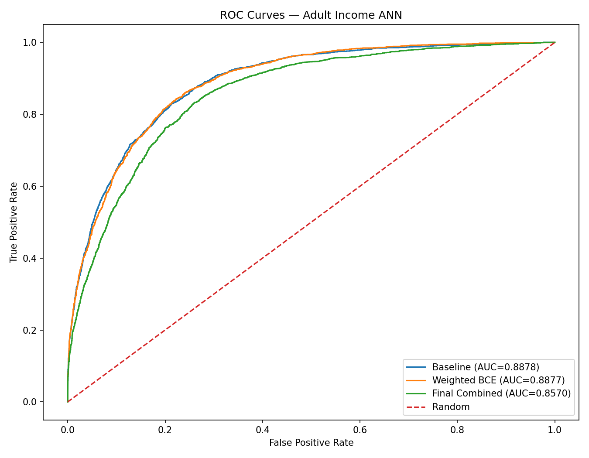

**Figure:** `roc_curves.png`

ROC-AUC evaluates how well the model separates the two income classes across different classification thresholds.

---

# 🔍 Technique Impact Analysis

The notebook calculates the F1-score improvement for:

- Best Activation vs Baseline
- Best Initializer vs Baseline
- Weighted BCE vs Baseline
- Focal Loss vs Baseline
- BatchNorm vs Baseline

The technique with the largest measured improvement is automatically identified from the actual experiment results.

---

# 📁 Repository Structure

```text
deep-learning-pr2-adult-income/
│
├── DL_PR2.ipynb
├── DL_PR2.html
├── README.md
├── requirements.txt
├── adult.csv
│
└── plots/
    ├── eda_class_balance.png
    ├── eda_age_by_income.png
    ├── eda_hours_boxplot.png
    ├── eda_education_by_income.png
    ├── eda_correlation_heatmap.png
    ├── baseline_training_curves.png
    ├── baseline_confusion_matrix.png
    ├── activation_comparison.png
    ├── relu_activation_distribution.png
    ├── sigmoid_gradient_magnitude.png
    ├── initialiser_convergence.png
    ├── zeros_failure.png
    ├── weight_distributions.png
    ├── loss_f1_comparison.png
    ├── weighted_bce_metrics.png
    ├── batchnorm_dynamics.png
    ├── batchnorm_position.png
    ├── batchnorm_gamma_beta.png
    ├── optimiser_convergence.png
    ├── learning_rate_sensitivity.png
    ├── results_table.csv
    └── roc_curves.png
```

---

# 🛠️ Technologies Used

- Python
- TensorFlow
- Keras
- Pandas
- NumPy
- Matplotlib
- Seaborn
- Scikit-learn
- Jupyter Notebook

---

# ▶️ Installation

Install dependencies:

```bash
pip install -r requirements.txt
```

Run Jupyter Notebook:

```bash
jupyter notebook
```

Open:

```text
DL_PR2.ipynb
```

Run all cells in sequence.

Before submission:

```text
Kernel → Restart & Run All
```

Confirm that the notebook executes with:

```text
ZERO ERRORS
```

Then export the notebook as:

```text
DL_PR2.html
```

---

# 📌 Key Learnings

- Deep Learning
- Binary Classification
- Adult Income Dataset
- Data Preprocessing
- Missing Value Handling
- One-Hot Encoding
- StandardScaler
- Data Leakage Prevention
- Stratified Train-Test Split
- Artificial Neural Networks
- Multi-Layer Perceptron
- ReLU Activation
- Tanh Activation
- Sigmoid Activation
- ELU Activation
- Dead Neurons
- Vanishing Gradients
- Weight Initialization
- Glorot Initialization
- He Initialization
- Binary Crossentropy
- MSE Classification Experiment
- Weighted Binary Crossentropy
- Focal Loss
- Batch Normalization
- SGD
- Momentum
- RMSprop
- Adam
- Learning Rate Sensitivity
- Precision
- Recall
- F1-Score
- ROC-AUC
- Confusion Matrix
- Model Comparison

---

# 🚀 Future Scope

- Hyperparameter tuning
- Cross-validation
- ROC-AUC optimization
- Precision-Recall AUC
- Threshold optimization
- Feature importance analysis
- SHAP explainability
- Model calibration
- Hyperparameter optimization
- ANN deployment using Flask/FastAPI
- Web application deployment
- Model monitoring
- Fairness and bias analysis
- Production model monitoring

---

# 👩‍💻 Author

**Sanika Kale**

MCA Student | Data Analytics, AI & Machine Learning

Red & White Skill Education

---

⭐ **If you found this project useful, consider giving it a star on GitHub!**
